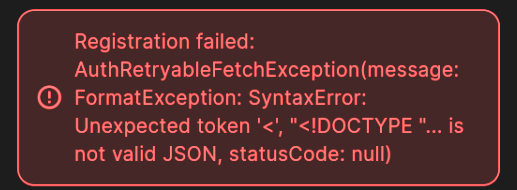
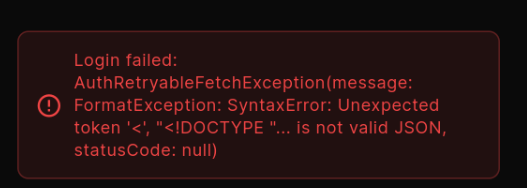
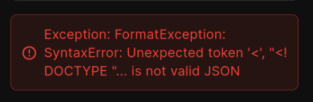

# Mewayz - All-in-One Business Platform

<div align="center">
  
  
  [](https://flutter.dev/)
  [](https://dart.dev/)
  [](https://supabase.com/)
  [](LICENSE)
  []()
</div>

## 🚀 Overview

Mewayz is a comprehensive, production-ready business platform that combines social media management, CRM, e-commerce, analytics, and team collaboration into a single powerful mobile application. Built with Flutter and powered by Supabase for scalability and performance.

### ✨ Key Features

- 🌐 **Social Media Management**: Schedule posts across Instagram, Facebook, Twitter, LinkedIn, YouTube, and TikTok
- 🔗 **Link in Bio Builder**: Create professional landing pages with real-time analytics
- 👥 **Advanced CRM System**: Manage contacts, leads, and customer relationships with automation
- 🛒 **E-commerce Integration**: Full marketplace with Stripe payment processing
- 📊 **Analytics Dashboard**: Comprehensive insights and cross-platform reporting
- 📧 **Email Marketing**: Campaign management with SendGrid integration
- 🎨 **Content Creation**: Templates, AI suggestions, and optimization tools
- 👨‍💼 **Team Collaboration**: Role-based access control and workspace management
- 🔐 **Enterprise Security**: End-to-end encryption, 2FA, and biometric authentication
- 📱 **Cross-Platform**: iOS and Android with responsive design

## 📱 Screenshots

| Enhanced Dashboard | Premium Social Hub | Advanced Analytics | CRM Management |
|---|---|---|---|
|  |  |  |  |

## 🛠️ Technology Stack

### Frontend
- **Framework**: Flutter 3.16+ with Material Design 3
- **Language**: Dart 3.2+ with null safety
- **State Management**: Optimized state management with Provider compatibility
- **UI Components**: Custom widgets with accessibility support
- **Responsive Design**: Adaptive layouts for all screen sizes

### Backend & Database
- **Backend**: Supabase (PostgreSQL + Auth + Storage + Edge Functions)
- **Database**: PostgreSQL with advanced schema and RLS policies
- **Authentication**: Supabase Auth with OAuth (Google, Apple)
- **Storage**: Supabase Storage for files and media
- **Real-time**: WebSocket subscriptions for live updates

### Integration & Services
- **Payment Processing**: Stripe, PayPal integration
- **Email Service**: SendGrid for transactional emails
- **SMS Service**: Twilio for notifications
- **Analytics**: Firebase Analytics, Mixpanel
- **Push Notifications**: Firebase Cloud Messaging
- **Social APIs**: Native integrations for all major platforms

### Security & Performance
- **Security**: AES-256 encryption, certificate pinning, RLS policies
- **Performance**: Intelligent caching, background job processing
- **Monitoring**: Real-time health monitoring and error tracking
- **Architecture**: Clean Architecture with Repository Pattern

## 🚀 Quick Start

### Prerequisites

- Flutter SDK 3.16 or higher
- Dart SDK 3.2 or higher
- Android Studio / VS Code
- Xcode (for iOS development)
- Supabase account
- Git

### 1. Clone & Install

```bash
# Clone the repository
git clone https://github.com/your-org/mewayz.git
cd mewayz

# Install dependencies
flutter pub get

# Verify installation
flutter doctor
```

### 2. Supabase Setup

1. **Create Supabase Project**:
   - Go to [supabase.com](https://supabase.com) and create a new project
   - Copy your project URL and anon key

2. **Run Database Migrations**:
   ```bash
   # Install Supabase CLI
   npm install -g supabase

   # Link to your project
   supabase link --project-ref YOUR_PROJECT_ID

   # Run migrations
   supabase db push
   ```

3. **Configure Authentication**:
   - Enable Email authentication in Supabase dashboard
   - Configure OAuth providers (Google, Apple)
   - Set up redirect URLs for mobile app

### 3. Environment Configuration

Create environment configuration file:

```bash
# Copy example file
cp .env.example .env
```

Configure the following required variables in `.env`:

```env
# Core Supabase Configuration
SUPABASE_URL=https://your-project.supabase.co
SUPABASE_ANON_KEY=your-supabase-anon-key

# Security
ENCRYPTION_KEY=your-32-character-encryption-key

# OAuth Authentication
GOOGLE_CLIENT_ID=your-google-client-id
APPLE_CLIENT_ID=com.mewayz.app

# Payment Processing
STRIPE_PUBLISHABLE_KEY=pk_test_your-stripe-key
PAYPAL_CLIENT_ID=your-paypal-client-id

# Communication Services
SENDGRID_API_KEY=SG.your-sendgrid-key
TWILIO_ACCOUNT_SID=your-twilio-sid

# Social Media APIs (Optional for testing)
INSTAGRAM_CLIENT_ID=your-instagram-client-id
FACEBOOK_APP_ID=your-facebook-app-id
TWITTER_API_KEY=your-twitter-api-key
```

### 4. Run the Application

```bash
# Development mode with environment variables
flutter run --dart-define-from-file=.env

# Or run with individual variables
flutter run \
  --dart-define=SUPABASE_URL=your-url \
  --dart-define=SUPABASE_ANON_KEY=your-key
```

### 5. Production Build

For production builds, use the provided scripts:

```bash
# Make scripts executable
chmod +x scripts/*.sh

# Validate production configuration
./scripts/validate_production.sh

# Build for production
./scripts/build_production.sh

# Deploy to stores
./scripts/deploy_android.sh  # Android
./scripts/deploy_ios.sh      # iOS (macOS only)
```

## 📖 Usage Examples

### Authentication Flow

```dart
// Sign up a new user
final authService = AuthService();
final result = await authService.signUp(
  email: 'user@example.com',
  password: 'securePassword123',
  fullName: 'John Doe',
);

// Sign in with email/password
final signInResult = await authService.signIn(
  email: 'user@example.com',
  password: 'securePassword123',
);

// Sign in with Google OAuth
final googleResult = await authService.signInWithGoogle();

// Enable biometric authentication
final biometricResult = await authService.enableBiometricAuth();
```

### Workspace Management

```dart
// Create a new workspace
final workspaceService = WorkspaceService();
final workspace = await workspaceService.createWorkspace(
  name: 'My Business',
  description: 'A comprehensive business workspace',
  goal: 'social_media_growth',
  settings: {
    'privacy': 'private',
    'team_access': true,
  },
);

// Invite team members
await workspaceService.inviteTeamMember(
  workspaceId: workspace.id,
  email: 'team@example.com',
  role: 'manager',
  permissions: ['content_creation', 'analytics_view'],
);
```

### Social Media Management

```dart
// Schedule a multi-platform post
final socialService = SocialMediaService();
await socialService.schedulePost(
  content: 'Check out our latest product!',
  platforms: ['instagram', 'facebook', 'twitter'],
  mediaUrls: ['https://example.com/image.jpg'],
  scheduledFor: DateTime.now().add(Duration(hours: 2)),
  hashtags: ['#business', '#growth', '#success'],
);

// Get analytics data
final analytics = await socialService.getAnalytics(
  workspaceId: workspace.id,
  platforms: ['instagram', 'facebook'],
  dateRange: DateRange(
    start: DateTime.now().subtract(Duration(days: 30)),
    end: DateTime.now(),
  ),
);
```

### CRM Integration

```dart
// Add a new contact
final crmService = CRMService();
final contact = await crmService.addContact(
  workspaceId: workspace.id,
  contact: Contact(
    name: 'Jane Smith',
    email: 'jane@example.com',
    phone: '+1234567890',
    source: 'instagram',
    tags: ['potential_customer', 'high_value'],
  ),
);

// Track contact interaction
await crmService.addInteraction(
  contactId: contact.id,
  type: 'email_sent',
  description: 'Welcome email campaign',
  metadata: {'campaign_id': 'welcome_2025'},
);
```

## 🏗️ Project Architecture

```
mewayz/
├── lib/
│   ├── core/                          # Core utilities and services
│   │   ├── supabase_service.dart      # Supabase client management
│   │   ├── app_initialization.dart    # Enhanced app initialization
│   │   ├── security_service.dart      # Security and encryption
│   │   └── performance_monitor.dart   # Performance monitoring
│   │
│   ├── services/                      # Business logic layer
│   │   ├── auth_service.dart          # Authentication services
│   │   ├── workspace_service.dart     # Workspace management
│   │   ├── unified_data_service.dart  # Unified data access
│   │   └── production_data_sync_service.dart # Production data sync
│   │
│   ├── presentation/                  # UI layer
│   │   ├── enhanced_workspace_dashboard/   # Main dashboard
│   │   ├── premium_social_media_hub/       # Social media management
│   │   ├── advanced_crm_management_hub/    # CRM features
│   │   ├── marketplace_store/              # E-commerce
│   │   └── unified_analytics_screen/       # Analytics
│   │
│   ├── widgets/                       # Reusable components
│   └── routes/                        # Navigation management
│
├── supabase/
│   └── migrations/                    # Database schema migrations
│
└── scripts/                           # Build and deployment scripts
```

## 🔐 Security Features

### Authentication & Access Control

- **Multi-Factor Authentication**: SMS, Email, and Authenticator app support
- **Biometric Authentication**: TouchID, FaceID, and Fingerprint support
- **OAuth Integration**: Google and Apple Sign-In
- **Session Management**: Secure token handling with auto-refresh
- **Role-Based Access Control**: Granular permissions system

### Data Protection

- **End-to-End Encryption**: AES-256 encryption for sensitive data
- **Row Level Security**: Database-level access control with Supabase RLS
- **Certificate Pinning**: Secure API communications
- **Input Validation**: Comprehensive data sanitization
- **Audit Logging**: Complete activity audit trail

### Privacy Compliance

- **GDPR Compliant**: Data deletion and export capabilities
- **CCPA Compliant**: California privacy law compliance
- **Privacy Controls**: Granular privacy settings
- **Data Minimization**: Only collect necessary data

## 🚀 Production Features

### Performance Optimization

- **Intelligent Caching**: Query result caching with automatic expiration
- **Background Jobs**: Asynchronous task processing
- **Database Optimization**: Advanced indexing and query optimization
- **Image Optimization**: Cached network images with compression
- **Code Splitting**: Optimized bundle sizes

### Monitoring & Analytics

- **System Health Monitoring**: Real-time performance metrics
- **Error Tracking**: Comprehensive error logging and reporting
- **Usage Analytics**: User behavior and engagement tracking
- **Performance Metrics**: App performance and optimization insights
- **Security Monitoring**: Threat detection and audit trails

### Scalability Features

- **Horizontal Scaling**: Designed for high-load scenarios
- **Auto-scaling**: Dynamic resource allocation
- **Load Balancing**: Distributed request handling
- **CDN Integration**: Global content delivery
- **Microservices Ready**: Modular architecture for scaling

## 🧪 Testing

### Running Tests

```bash
# Run all tests
flutter test

# Run tests with coverage
flutter test --coverage

# Run integration tests
flutter drive \
  --driver=test_driver/integration_test.dart \
  --target=integration_test/app_test.dart

# Run specific test suites
flutter test test/services/auth_service_test.dart
flutter test test/widgets/custom_button_test.dart
```

### Test Coverage

The project maintains high test coverage across:

- **Unit Tests**: Core business logic and services
- **Widget Tests**: UI components and interactions
- **Integration Tests**: End-to-end user flows
- **Security Tests**: Authentication and authorization flows
- **Performance Tests**: Load testing and optimization validation

## 🤝 Contributing

We welcome contributions from the community! Please follow these guidelines:

### Getting Started

1. **Fork the Repository**:
   ```bash
   git fork https://github.com/your-org/mewayz.git
   cd mewayz
   ```

2. **Create Feature Branch**:
   ```bash
   git checkout -b feature/amazing-feature
   ```

3. **Set Up Development Environment**:
   ```bash
   flutter pub get
   cp .env.example .env.development
   # Configure development environment variables
   ```

### Development Guidelines

#### Code Standards

- **Follow Dart/Flutter Style Guide**: Use `flutter analyze` and `dart format`
- **Write Tests**: Maintain test coverage above 80%
- **Document Code**: Use clear comments and documentation
- **Security First**: Follow security best practices
- **Performance**: Optimize for performance and memory usage

#### Commit Guidelines

```bash
# Use conventional commits
git commit -m "feat: add advanced CRM automation"
git commit -m "fix: resolve authentication token refresh issue"
git commit -m "docs: update API integration guide"
```

#### Pull Request Process

1. **Ensure Tests Pass**:
   ```bash
   flutter test
   flutter analyze
   ./scripts/validate_production.sh
   ```

2. **Update Documentation**: Update relevant documentation
3. **Create Pull Request**: Provide clear description and context
4. **Code Review**: Address feedback and suggestions
5. **Merge**: Squash and merge when approved

### Contributing Areas

- 🐛 **Bug Fixes**: Fix issues and improve stability
- ✨ **New Features**: Add new functionality and integrations
- 📚 **Documentation**: Improve guides and API documentation
- 🔧 **Performance**: Optimize app performance and memory usage
- 🎨 **UI/UX**: Enhance user interface and experience
- 🧪 **Testing**: Add tests and improve coverage
- 🔒 **Security**: Strengthen security and privacy features

### Community Guidelines

- Be respectful and inclusive
- Provide constructive feedback
- Help others learn and grow
- Follow our Code of Conduct
- Report issues responsibly

## 📊 Performance Metrics

### Target Performance

- **App Launch Time**: < 3 seconds cold start
- **Memory Usage**: < 150MB average
- **Battery Usage**: Minimal background consumption
- **Network Efficiency**: Optimized API calls with caching
- **Database Performance**: < 100ms query response time

### Success Metrics

- **User Retention**: > 70% day-1, > 40% day-7, > 20% day-30
- **App Store Rating**: > 4.5 stars
- **Crash Rate**: < 0.1%
- **Performance Score**: > 95% (Firebase Performance)
- **Security Score**: A+ grade security rating

## 🛠️ Troubleshooting

### Common Issues

#### Environment Setup Issues

**Problem**: Supabase connection fails
```bash
# Solution: Verify environment variables
flutter run --dart-define=DEBUG_MODE=true
# Check logs for detailed error messages
```

**Problem**: OAuth authentication not working
```bash
# Solution: Check OAuth configuration
# 1. Verify client IDs in Supabase dashboard
# 2. Check redirect URIs
# 3. Ensure OAuth apps are configured correctly
```

#### Build Issues

**Problem**: Build fails with dependency errors
```bash
# Solution: Clean and reinstall dependencies
flutter clean
flutter pub get
flutter pub deps
```

**Problem**: Android build fails
```bash
# Solution: Check Android configuration
cd android
./gradlew clean
cd ..
flutter build apk --debug
```

#### Runtime Issues

**Problem**: App crashes on startup
```bash
# Solution: Check initialization logs
flutter run --verbose
# Look for initialization errors in console
```

**Problem**: API calls failing
```bash
# Solution: Verify network and API configuration
# 1. Check internet connectivity
# 2. Verify API keys are correct
# 3. Test API endpoints manually
```

### Getting Help

- 📧 **Email Support**: support@mewayz.com
- 💬 **Discord Community**: [Join our Discord](https://discord.gg/mewayz)
- 📚 **Documentation**: [docs.mewayz.com](https://docs.mewayz.com)
- 🐛 **Bug Reports**: [GitHub Issues](https://github.com/your-org/mewayz/issues)
- 💡 **Feature Requests**: [GitHub Discussions](https://github.com/your-org/mewayz/discussions)

### Debug Mode

Enable debug mode for detailed logging:

```bash
flutter run \
  --dart-define=DEBUG_MODE=true \
  --dart-define=ENABLE_LOGGING=true
```

## 📋 Production Deployment

### Pre-Deployment Checklist

- [ ] All environment variables configured
- [ ] API keys obtained and tested
- [ ] Supabase project configured with RLS policies
- [ ] OAuth applications configured for production
- [ ] Payment processing tested (Stripe/PayPal)
- [ ] Push notifications configured (FCM/APNS)
- [ ] App icons and screenshots prepared
- [ ] Store listings completed
- [ ] Privacy policy and terms updated
- [ ] Security audit completed
- [ ] Performance optimization verified
- [ ] All tests passing
- [ ] Beta testing completed

### Store Submission

#### Google Play Store

1. **Prepare Release**:
   ```bash
   ./scripts/deploy_android.sh
   ```

2. **Upload to Play Console**:
   - Upload AAB file
   - Complete store listing
   - Add screenshots and videos
   - Submit for review

#### Apple App Store

1. **Prepare Release**:
   ```bash
   ./scripts/deploy_ios.sh
   ```

2. **Upload to App Store Connect**:
   - Upload IPA file via Xcode or Transporter
   - Complete store listing
   - Add screenshots and videos
   - Submit for review

### Monitoring Setup

Configure production monitoring:

- **Crash Reporting**: Firebase Crashlytics
- **Performance Monitoring**: Firebase Performance
- **User Analytics**: Mixpanel, Firebase Analytics
- **Error Tracking**: Sentry integration
- **Uptime Monitoring**: Status page monitoring

## 📝 License & Legal

### License

This project is licensed under the MIT License - see the [LICENSE](LICENSE) file for details.

### Privacy & Legal

- **Privacy Policy**: [mewayz.com/privacy-policy](https://mewayz.com/privacy-policy)
- **Terms of Service**: [mewayz.com/terms-of-service](https://mewayz.com/terms-of-service)
- **Cookie Policy**: [mewayz.com/cookie-policy](https://mewayz.com/cookie-policy)
- **Data Protection**: GDPR and CCPA compliant
- **Security Policy**: [Security practices and reporting](https://mewayz.com/security)

## 🎯 Roadmap

### Upcoming Features

- [ ] **AI-Powered Content Creation**: Advanced AI tools for content generation
- [ ] **Advanced Automation Workflows**: No-code automation builder
- [ ] **Multi-Language Support**: Internationalization for global markets
- [ ] **Desktop Application**: Electron-based desktop version
- [ ] **API Marketplace**: Third-party integrations marketplace
- [ ] **White-Label Solutions**: Customizable branding for enterprises
- [ ] **Advanced Analytics**: Machine learning insights and predictions
- [ ] **Video Content Management**: Advanced video editing and scheduling
- [ ] **Voice Assistant Integration**: Voice commands for hands-free operation
- [ ] **Blockchain Integration**: NFT and cryptocurrency support

### Technical Improvements

- [ ] **Offline Mode**: Full offline functionality with sync
- [ ] **Progressive Web App**: PWA version for web browsers
- [ ] **Real-time Collaboration**: Live collaborative editing
- [ ] **Advanced Security**: Zero-trust security architecture
- [ ] **Performance Optimization**: Further performance enhancements
- [ ] **Accessibility**: Enhanced accessibility features

## 🙏 Acknowledgments

### Core Team

- **Development Team**: For building this comprehensive platform
- **Design Team**: For creating an intuitive and beautiful user experience
- **Security Team**: For ensuring enterprise-grade security
- **QA Team**: For maintaining high quality standards

### Open Source Community

- **Flutter Team**: For the amazing cross-platform framework
- **Supabase Team**: For the excellent backend-as-a-service platform
- **Community Contributors**: For valuable contributions and feedback
- **Beta Testers**: For helping us perfect the user experience

### Technology Partners

- **Google**: For Firebase services and OAuth integration
- **Apple**: For App Store and iOS ecosystem support
- **Stripe**: For reliable payment processing
- **SendGrid**: For email delivery services
- **Twilio**: For SMS and communication services

---

<div align="center">
  
## 🌟 Ready to Transform Your Business?

**Get Started Today**: Download Mewayz and experience the future of business management.

[](https://apps.apple.com/app/mewayz/id1234567890)
[](https://play.google.com/store/apps/details?id=com.mewayz.app)

### Stay Connected

[](https://mewayz.com)
[](https://twitter.com/mewayz)
[](https://linkedin.com/company/mewayz)
[](https://discord.gg/mewayz)

---

Made with ❤️ by the Mewayz Team | © 2025 Mewayz. All rights reserved.

</div>